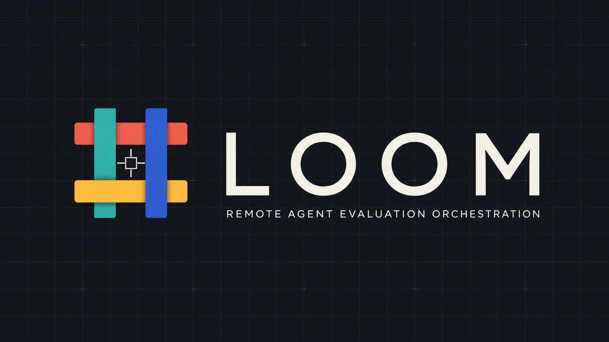

# Loom

<p align="center">
  
</p>

**Leased Orchestration for Observable Model work.**

Loom is a reliable, inventory-driven task control plane for agent evaluation.
It dispatches normalized work across operator-owned hosts: the **Loom Hub** owns
scheduling, leases, concurrency policy, retries, and result intake; **Loom
Runners** execute ordered task packages and return compact, queryable result
ZIPs.

[Remote quick start](#remote-quick-start) |
[Manifest](docs/TASK_MANIFEST.md) |
[Architecture](docs/ARCHITECTURE.md) |
[Core Preview v1](docs/CORE_PREVIEW_V1.md) |
[Release contract](docs/RELEASE_CONTRACT.md) |
[Support scope](docs/SCOPE.md)

## The Name

**Loom** is the short name for **Leased Orchestration for Observable Model
work**. A loom brings separate threads into one ordered fabric; Loom brings task
definitions, available hosts, leases, and evidence packages into one recoverable
execution flow.

## What You Get

- **Explicit benchmark work units.** Model every runnable unit as a campaign,
  case, setting, and run instead of handing a worker an ambiguous instruction.
- **Controller-owned scheduling.** Workers advertise a hard capacity, while the
  controller controls leases, desired concurrency, retries, and recovery.
- **Resource-aware shared-host admission.** A task can reserve CPU, memory,
  disk, and accelerators before it is leased, while `shared` and `exclusive`
  placement make host multiplexing explicit instead of accidental.
- **Frozen Core Preview v1 contracts.** Versioned inventory, manifest, dispatch,
  token, CLI, and capability-query contracts keep downstream automation on a
  documented surface rather than internal Python helpers.
- **Remote worker connections that persist.** Bootstrap workers once over SSH,
  use long-polling for quieter idle periods, or expose an authenticated worker
  control API. Direct Runners can pull work or receive Hub-leased exact tasks;
  the task queue and state machine always stay in the controller.
- **Versioned phase contracts.** A repository task can declare named prepare,
  evaluate, and collect phases with phase-specific arguments, environment,
  timeouts, artifact paths, and immutable runtime IDs.
- **Recoverable evidence.** Each attempt keeps its task ID, attempt number,
  worker identity, logs, explicit artifacts, and result ZIP. A later successful
  retry does not erase the earlier failure package.
- **A small operating footprint.** The implementation uses the Python standard
  library and a SQLite-backed controller; no package installation is required.

## Supported Boundary

> [!IMPORTANT]
> This project starts after controller and worker hosts already exist. Automatic
> cloud resource creation, resizing, billing, teardown, and provider credential
> management are intentionally unsupported and are not on the roadmap.

Supply an operator-owned inventory, then use Loom Hub to deploy or connect
Loom Runners on those hosts. The retained
`tools/loom_tencent_provision_reference.py`, `tools/loom_tencent_e2e_reference.py`, and
`tools/loom_aws_smoke_reference.py` files are historical/community
references, not supported interfaces. A maintained provisioning integration
needs a contributor-owned pull request with provider-specific tests, security,
cost, failure-recovery, and cleanup behavior.

Read the complete [support scope](docs/SCOPE.md) before changing the
infrastructure boundary.

## Remote Quick Start

This is the supported path for dispatching work to an existing remote fleet.
Run these commands from an operator control environment; Loom Matrix coordinates
the actual work on the hosts named in the inventory.

1. Start from
   [`examples/loom-inventory.example.json`](examples/loom-inventory.example.json)
   and replace its sample addresses, users, SSH key paths, controller URLs, and
   worker capabilities with your own existing hosts.
2. Define the campaign as explicit case/run records. The
   [task input manual](docs/TASK_MANIFEST.md) covers the schema, private
   source repositories, artifacts, retries, and expected outcomes.
3. Normalize the handoff into a controller dispatch specification:

   ```bash
   python3 tools/loom_manifest.py campaign.json \
     --operator my-team \
     --output campaign.dispatch.json
   ```

4. Deploy or connect to the inventory, dispatch the specification, and wait for
   remote results:

   ```bash
   export LOOM_HUB_TOKEN='generate-and-store-outside-the-inventory'
   export LOOM_RUNNER_TOKEN='separate-direct-runner-token'

   python3 tools/loom_matrix.py \
     --inventory /path/to/operator-owned/inventory.json \
     --dispatch-spec campaign.dispatch.json \
     --output remote-run-summary.json
   ```

For a private source repository, add `--forward-env SOURCE_REPO_TOKEN` and make
that variable available only in the operator environment. The worker uses it
through `GIT_ASKPASS`; the token is not placed in task JSON, command logs, or
result ZIPs. Matrix forwards the Hub and Direct Runner token environment
variables through temporary `0600` remote files and records only their names.

`loom_matrix.py` deploys Loom Hub and Loom Runner scripts only. It does not
create, resize, stop, or delete cloud resources.

## How A Run Moves

```text
campaign manifest -> normalized dispatch spec -> controller -> workers -> result ZIPs -> query, retry, or recover
```

| Role | Owns |
| --- | --- |
| Operator | Existing hosts, network policy, credentials, and infrastructure lifecycle. |
| Loom Hub | Task dispatch, leases, state transitions, desired concurrency, result intake, audit logs, and data queries. |
| Loom Runner | Capability registration, heartbeats, task execution, artifact collection, and result upload. |

Loom Hub is the single source of truth for task state. Loom Runners report
execution facts; they do not operate an independent queue.

## Connection Modes

Choose a connection mode per host in the inventory:

| Mode | Use it when |
| --- | --- |
| `ssh-start` | SSH should bootstrap a long-lived Loom Runner, after which scheduling uses the Hub HTTP API rather than a fresh SSH session for each task. |
| `long-poll` | An idle Loom Runner should keep a claim request open briefly instead of repeatedly polling the Hub. |
| `direct-worker-api` | A Runner-side authenticated HTTP endpoint. Select `direct_api_dispatch_mode: "pull"` for a Runner pull loop or `"push"` for Hub-leased exact task delivery. Task state still belongs to Loom Hub. |

Inventory-level `ssh_control_persist` supports SSH `ControlMaster`/
`ControlPersist` reuse during setup. See the
[architecture guide](docs/ARCHITECTURE.md#control-plane) for placement and
networking details.

## Task Model And Recovery

Every runnable task has four mandatory identifiers:

```text
campaign_id + case_id + setting_id + run_id
```

Loom Manifest derives a stable task ID from those values. That makes an
individual run queryable, cancellable, retryable, and inspectable without
disturbing adjacent work. Optional retry policies can limit retries to known
transient categories and require the retry to land on a different capable
worker.

Repository tasks describe a source checkout, ordered commands, timeouts, and an
explicit artifact allowlist. Loom Runners materialize the source in a per-task
workspace, then upload only metadata, command logs, and requested artifacts.
Full source checkouts are deliberately excluded from result packages.

See [Loom Manifest](docs/TASK_MANIFEST.md) for the full JSON/JSONL
schema and [Architecture](docs/ARCHITECTURE.md#repo-task-delivery) for the
delivery protocol.

## Documentation

| Guide | When to read it |
| --- | --- |
| [Loom Scope](docs/SCOPE.md) | Before changing host, provider, or resource-lifecycle behavior. |
| [Loom Manifest](docs/TASK_MANIFEST.md) | When preparing a campaign, retry policy, private source, or expected-result contract. |
| [Resource Admission](docs/RESOURCE_ADMISSION.md) | When sharing existing workers safely with declared task resource requests. |
| [Release Contract](docs/RELEASE_CONTRACT.md) | When changing phases, Direct Runner delivery, authentication, result retention, or release gates. |
| [AgentDojo Release Fixture](docs/AGENTDOJO_EXAMPLE.md) | When running or inspecting the fixed 2-case x 2-run x 2-attempt remote regression. |
| [Architecture](docs/ARCHITECTURE.md) | When integrating the Hub, Runner, connection modes, concurrency behavior, or result APIs. |
| [Loom Remote Validation](docs/REMOTE_VALIDATION.md) | When validating the inventory-driven remote path on operator-supplied Tencent hosts. |

## Repository Map

```text
tools/loom_hub.py                # Loom Hub API, SQLite state, and CLI
tools/loom_runner.py             # Loom Runner
tools/loom_manifest.py           # Loom Manifest normalizer
tools/loom_matrix.py             # Loom Matrix remote runner
examples/loom-inventory.example.json
docs/
```

## Contributing

Contributions are welcome. Please keep the ownership boundary intact: this
project coordinates work on supplied hosts, while infrastructure lifecycle
belongs to the operator or a separate infrastructure system. A proposal to
maintain automatic provisioning must include its provider-specific validation,
security, cost, recovery, and cleanup contract.

## License

[MIT](LICENSE).
